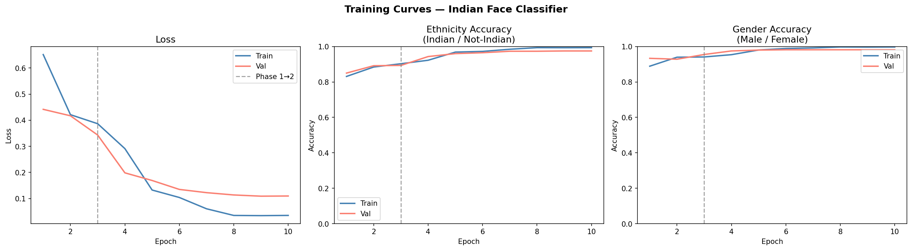
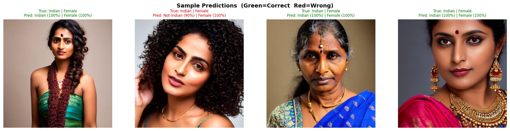
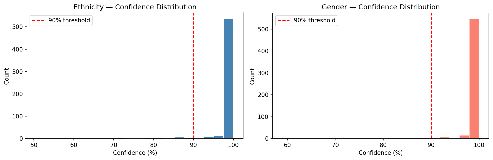
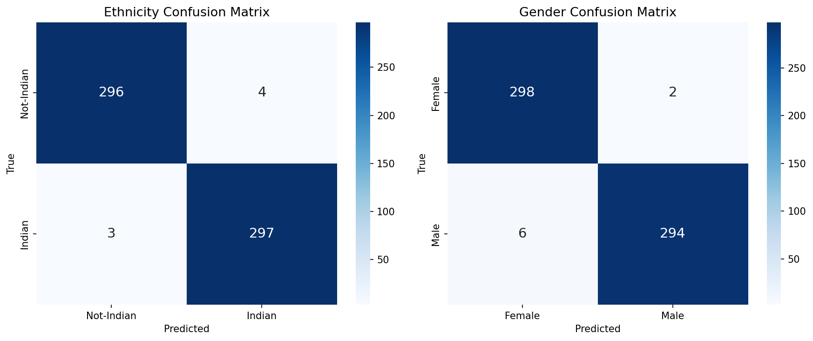

# Human Face Classification using Deep Learning

## Description
This project implements a Convolutional Neural Network (CNN) to classify facial images into four dataset-defined classes:
- Indian Male
- Indian Female
- Non-Indian Male
- Non-Indian Female

## Technologies Used
- Python
- TensorFlow
- Keras
- NumPy
- Pandas
- Matplotlib

## Features
- Image preprocessing
- Data augmentation
- CNN model training
- Model evaluation
- Multi-class image classification
## Results

The trained model was evaluated using multiple performance metrics and visualizations.

### 📈 Training Curves

Displays the training and validation accuracy/loss over epochs.

---

### 🎯 Sample Predictions

Shows predictions made by the trained CNN model on unseen facial images.

---

### 📊 Confidence Distribution

Illustrates the confidence scores of the model across predictions.

---

### 📉 Confusion Matrix

Visualizes the classification performance for all four classes.

